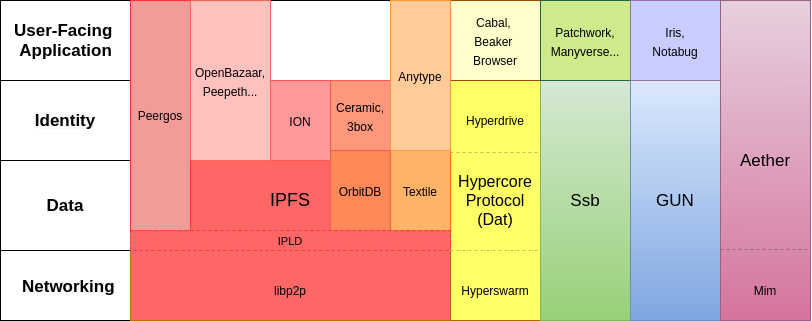
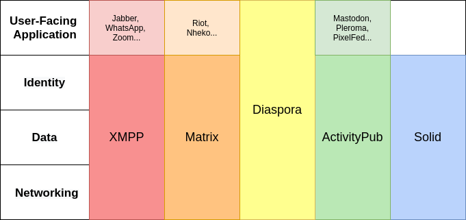

# Ecosystem Overview

This overview of the decentralized social ecosystem is structured by protocols, applications, and topics. The protocols and applications directories contain summaries of existing projects. The topics section compares how decentralized protocols handle key topics, and includes relevant projects not covered elsewhere.

### Protocols:

- [ActivityPub](protocols/activitypub.md)
- [Gun](protocols/gun.md)
- [Hypercore Protocol (DAT)](protocols/hypercore.md)
- [IPFS](protocols/ipfs.md)
- [Matrix](protocols/matrix.md)
- [Peergos](protocols/peergos.md)
- [Solid](protocols/solid.md)
- [XMPP](protocols/xmpp.md)

### Applications:

- [Aether](applications/aether.md)
- [Blockchain social networks](applications/blockchain-social.md)
- [Diaspora](applications/diaspora.md)
- [Mastodon](applications/mastodon.md)
- [Ssb social networks](applications/ssb.md)

In the p2p ecosystem, there is sometimes not a clear distinction between protocols and applications, making it unclear what a project encompasses. This diagram attempts to clarify which layer of the stack these p2p projects operate at.

The distinction between protocols and applications is clearer in the federated social ecosystem, where applications follow a familiar client-server model. Diaspora is both the name of the social application as well as the protocol, and Solid does not yet have a social network application.

### Topics:

[Network structure](topics/network-structure.md)

- Federated networks
  - Passing messages between systems
  - Replicating data between systems
- P2p networks
- Hybrid

[Identity](topics/identity.md)

- Decentralized identity
- In federated applications
- In p2p applications
- Blockchain identity systems
- DIDs
- Key management
- Reputation, Trust
- Failure modes:
  - Sybils & spam
  - Impersonation

[Data](topics/data.md)

- Data models
- Mutability

[Discovery](topics/discovery.md)

- Curation
- Search

[Moderation](topics/moderation.md)

- Community-based
- User-driven
- Experimental

[Privacy](topics/privacy.md)

- User metadata
- Private accounts
- Direct messages

[Monetization](topics/monetization.md)

- Application level
- Provider level
- Protocol level

[Governance](topics/governance.md)

- Overview of existing models

## Contributions

Written by Jay Graber ([@arcalinea](https://twitter.com/arcalinea))

Contributions from:

- Andre Staltz ([@andrestaltz](https://twitter.com/andrestaltz))
- Burak Nehbit ([@nehbit](https://twitter.com/nehbit))
- Christopher Lemmer Webber ([@dustyweb](https://twitter.com/dustyweb))
- Danny Zuckerman ([@dazuck](https://twitter.com/dazuck))
- Eugen Rochko ([@Gargron@mastodon.social](https://mastodon.social/@Gargron))
- Golda Velez ([@gvelez17](https://twitter.com/gvelez17))
- Ian Preston ([@Ianopolous](https://twitter.com/Ianopolous))
- Jeromy Johnson ([@whyrusleeping](https://twitter.com/whyrusleeping))
- Molly MacKinley ([@momack28](https://twitter.com/momack28))
- Matthew Hodgson ([@ara4n](https://twitter.com/ara4n))
- Mark Nadal ([@marknadal](https://twitter.com/marknadal))
- Paul Frazee ([@pfrazee](https://twitter.com/pfrazee))
- Rahul Kothari ([@BlockchainRahul](https://twitter.com/BlockchainRahul))
- Sarven Capadisli ([@csarven](https://twitter.com/csarven))

## Further Reading

More extensive lists of decentralized web projects:

- [Redecentralize](https://github.com/redecentralize/alternative-internet)
- [Decentralized Web projects by gdamdam](https://github.com/gdamdam/awesome-decentralized-web)
- [A list of p2p resources by kgryte](https://github.com/kgryte/awesome-peer-to-peer)
